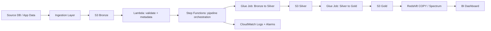

# Optional Orchestration Extension — Lambda + Step Functions

This repository currently focuses on core platform services (S3, Glue, Athena, EC2, Redshift, RDS, DynamoDB).
If you already implemented Lambda and Step Functions in your project, this document can be used as the portfolio section for orchestration.

## Why include orchestration
- Moves pipeline from manual execution to event/workflow-driven execution.
- Adds retry, branching, failure handling, and observability.
- Demonstrates real data-engineering operations maturity.

## Suggested end-to-end orchestrated flow

## State machine stages (recommended)
1. **StartExecution** (scheduled or event-driven)
2. **SchemaCheck (Lambda)**
3. **QualityGate (Lambda/Glue)**
4. **TransformSilver (Glue)**
5. **TransformGold (Glue)**
6. **LoadWarehouse (Lambda or Redshift Data API)**
7. **PublishStatus (SNS/EventBridge)**

## Minimal technical artifacts to add (if you want this in repo)
- `templates/stepfunctions-pipeline.yaml`
- `lambda/validate_schema.py`
- `lambda/publish_status.py`
- `docs/architecture-diagram.png`
- `sql/redshift/load_gold_to_mart.sql`

## KPI examples for this extension
- pipeline success rate
- average run duration
- failed records per run
- freshness SLA (max data latency)

## Public-safe note
Keep all ARNs, account IDs, role names, and endpoints parameterized using placeholders.
